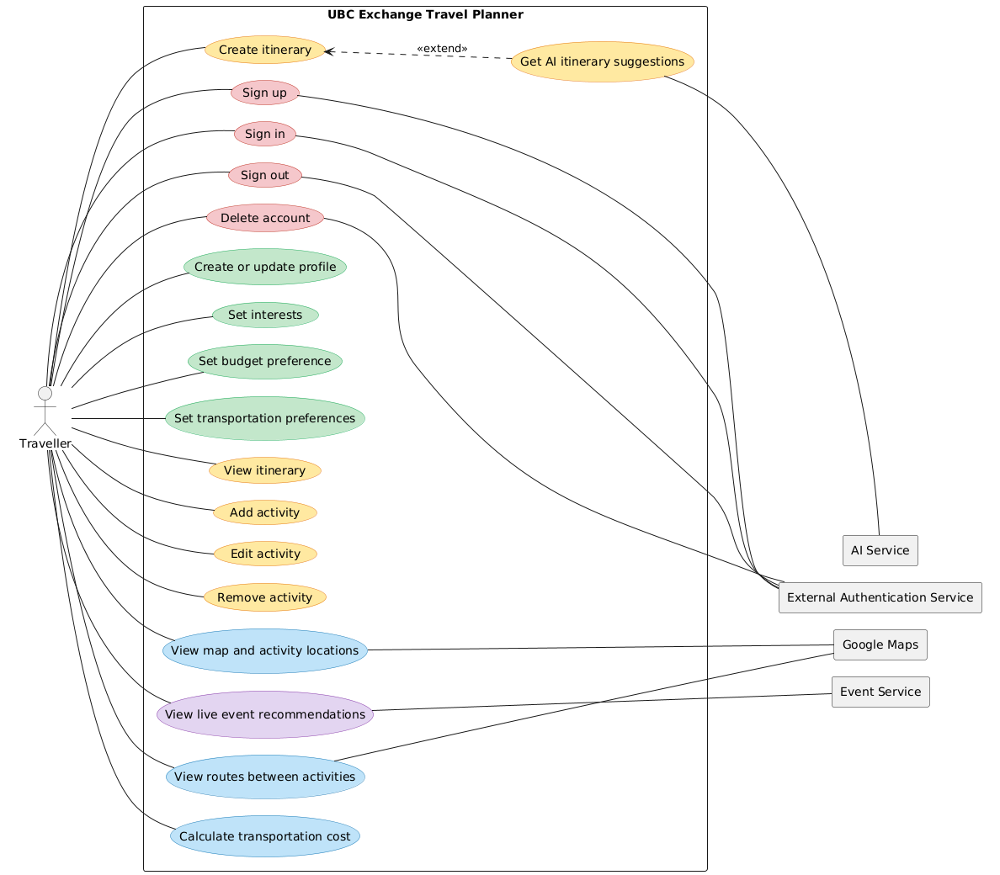
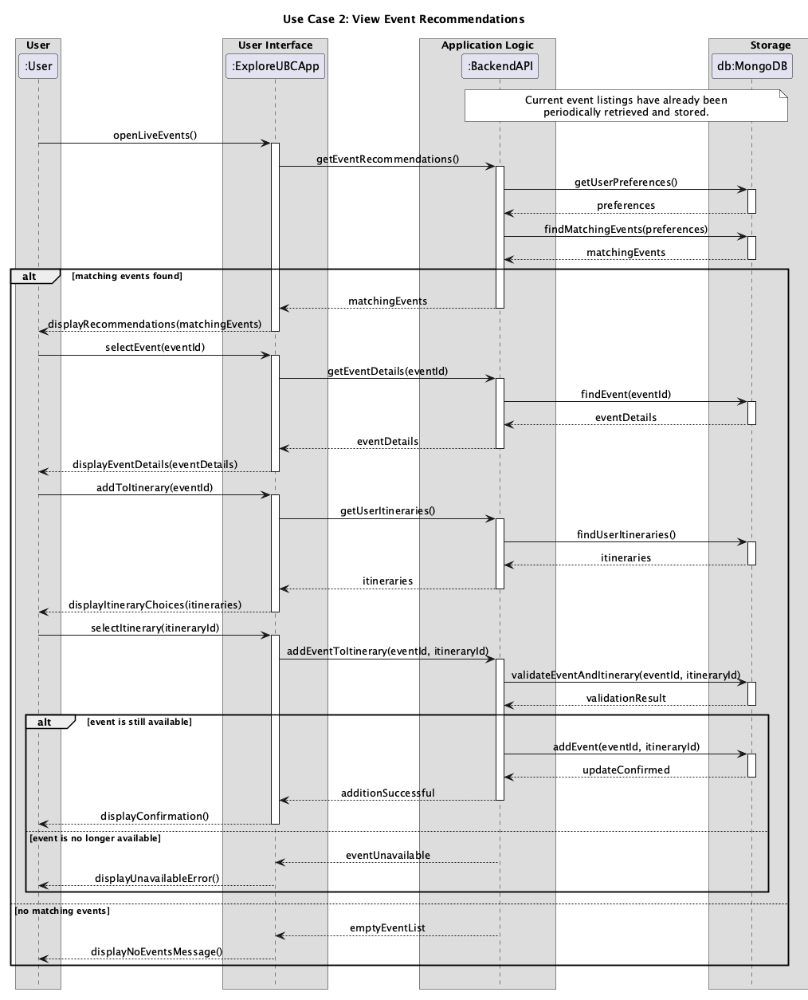

# Requirements and Design

## 1. Change History

| **Change Date**   | **Modified Sections** | **Rationale** |
| ----------------- | --------------------- | ------------- |
| _Nothing to show_ |

---

## 2. Project Description

[WRITE_PROJECT_DESCRIPTION_HERE]

---

## 3. Requirements Specification

### **3.1. List of Features**

### **3.2. Use Case Diagram**

### **3.3. Actors Description**

1. **[WRITE_NAME_HERE]**: ...
2. **[WRITE_NAME_HERE]**: ...

### **3.4. Use Case Description**

- Use cases for feature 1: [WRITE_FEATURE_1_NAME_HERE]

1. **[WRITE_NAME_HERE]**: ...
2. **[WRITE_NAME_HERE]**: ...

- Use cases for feature 2: [WRITE_FEATURE_2_NAME_HERE]

3. **[WRITE_NAME_HERE]**: ...
4. **[WRITE_NAME_HERE]**: ...
   ...

### **3.5. Formal Use Case Specifications (5 Most Major Use Cases)**

#### Use Case 1: [WRITE_USE_CASE_1_NAME_HERE]

**Description**: ...

**Primary actor(s)**: ...

**Main success scenario**:

1. ...
2. ...

**Failure scenario(s)**:

- 1a. ...
  - 1a1. ...
  - 1a2. ...

- 1b. ...
  - 1b1. ...
  - 1b2. ...
- 2a. ...
  - 2a1. ...
  - 2a2. ...

...

#### Use Case 2: View Event Recommendations

**Description**: The user views event recommendations personalised to their interests and location. The system periodically retrieves event listings from an external event service to keep the recommendations current. The user can view an event’s details and add it to an itinerary.

**Primary actor(s)**: User

**Secondary actor(s)**: External Event Service

**Preconditions:**

- The user has saved interests and a location in their profile.
- The system has retrieved and stored event listings during a periodic check.

**Main success scenario**:

1. The user opens the live-events feature.
2. The system displays events matching the user’s interests and location.
3. The user selects an event.
4. The system displays the event’s details.
5. The user chooses to add the event to an itinerary.
6. The system displays the user's itineraries.
7. The user selects an itinerary.
8. The system verifies that the event is still available and stores it in the selected itinerary.

**Failure scenario(s)**:

- 2a. No events match the user’s interests and location.
  - 2a1. The system shows that no events are available at the moment.
- 6a. The user does not have a saved itinerary.
  - 6a1. The system informs the user that no itinerary is available and offers the option to create one.
  - 6a2. The user chooses to create an itinerary and enters its required details.
  - 6a3. The system creates the itinerary.
  - 6a4. The flow continues at step 8 using the newly created itinerary.
- 8a. The selected event is no longer available.
  - 8a1. The system tells the user the event can no longer be added.
  - 8a2. The system leaves the itinerary unchanged and lets the user choose another event.

#### Use Case 3: Calculate Transportation Cost

**Description**: The user selects car or public transport for their itinerary. The system uses route information from Google Maps and the relevant cost data to calculate and display the estimated transportation cost. For a car journey, the system uses the vehicle type saved in the user’s profile.

**Primary actor**: User

**Supporting actors**: Google Maps, External fuel-price data source

**Preconditions**:

- The user has created an itinerary containing activities with locations.
- The user’s profile contains a vehicle type if they want a car-cost estimate.

**Main success scenario**:

1. The user opens the transportation cost calculator for the itinerary.
2. The system retrieves the itinerary’s locations and route information from Google Maps.
3. The user selects car or public transport and, if they choose car, optionally enters their vehicle type. If they don’t provide one, the system uses an average car for the estimate.
4. If the user selects car, the system offers the choice of entering a vehicle type or using an average car.
5. The user makes a selection.
6. The system calculates the estimated cost using the selected transportation mode and the required route and cost information.
7. The system displays the estimated transportation cost.

**Failure scenario**:

- 3a. The system cannot identify the vehicle type entered by the user.
  - 3a1. The system informs the user that it could not find that vehicle type.
  - 3a2. The user can enter another vehicle type or continue with the average car estimate.
- 4a. Google Maps cannot provide a route or the required cost information for the selected mode.
  - 4a1. The system informs the user that it cannot calculate the cost for that mode.
  - 4a2. The user can select the other transportation mode.

**Postcondition:** The system displays the estimated cost for the selected mode, or informs the user when it cannot calculate the cost.

### **3.6. Screen Mock-ups**

### **3.7. Non-Functional Requirements**

1. **[WRITE_NAME_HERE]**
   - **Description**: ...
   - **Justification**: ...
2. ...

---

## 4. Designs Specification

### **4.1. Main Components**

1. **[WRITE_NAME_HERE]**
   - **Purpose**: ...
   - **Interfaces**:
     1. ...
        - **Purpose**: ...
     2. ...
2. ...

### **4.2. Databases**

1. **[WRITE_NAME_HERE]**
   - **Purpose**: ...
2. ...

### **4.3. External Modules**

1. **[WRITE_NAME_HERE]**

- **Purpose**: ...

2. ...

### **4.4. Frameworks and Libraries**

1. **[WRITE_NAME_HERE]**
   - **Purpose**: ...
   - **Reason**: ...
2. ...

### **4.5. Dependencies Diagram**

### **4.6. Use Case Sequence Diagram (5 Most Major Use Cases)**

1. [**[WRITE_NAME_HERE]**](#uc1)\
   [SEQUENCE_DIAGRAM_HERE]
2. [**View Event Recommendations**](#uc2)\
   

### **4.7. Design of Non-Functional Requirements**

1. [**[WRITE_NAME_HERE]**](#nfr1)
   - **Implementation**: ...
2. ...
