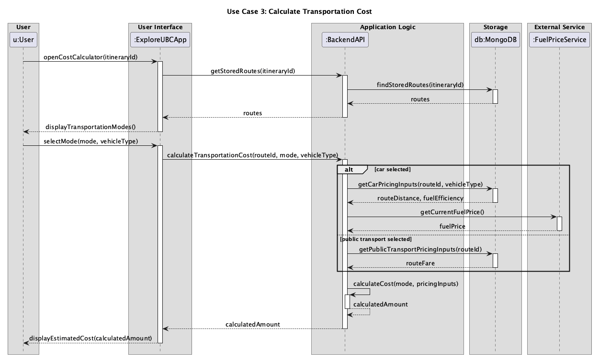

# Requirements and Design

## 1. Change History

| **Change Date**   | **Modified Sections** | **Rationale** |
| ----------------- | --------------------- | ------------- |
| _Nothing to show_ |

---

## 2. Project Description

[WRITE_PROJECT_DESCRIPTION_HERE]

---

## 3. Requirements Specification

### **3.1. List of Features**

### **3.2. Use Case Diagram**

### **3.3. Actors Description**

1. **[WRITE_NAME_HERE]**: ...
2. **[WRITE_NAME_HERE]**: ...

### **3.4. Use Case Description**

- Use cases for feature 1: [WRITE_FEATURE_1_NAME_HERE]

1. **[WRITE_NAME_HERE]**: ...
2. **[WRITE_NAME_HERE]**: ...

- Use cases for feature 2: [WRITE_FEATURE_2_NAME_HERE]

3. **[WRITE_NAME_HERE]**: ...
4. **[WRITE_NAME_HERE]**: ...
   ...

### **3.5. Formal Use Case Specifications (5 Most Major Use Cases)**

#### Use Case 1: [WRITE_USE_CASE_1_NAME_HERE]

**Description**: ...

**Primary actor(s)**: ...

**Main success scenario**:

1. ...
2. ...

**Failure scenario(s)**:

- 1a. ...
  - 1a1. ...
  - 1a2. ...

- 1b. ...
  - 1b1. ...
  - 1b2. ...
- 2a. ...
  - 2a1. ...
  - 2a2. ...

...

#### Use Case 2: View Event Recommendations

**Description**: The user views event recommendations personalised to their interests and location. The system periodically retrieves event listings from an external event service to keep the recommendations current. The user can view an event’s details and add it to an itinerary.

**Primary actor(s)**: User

**Secondary actor(s)**: External Event Service

**Preconditions:**

- The user has saved interests and a location in their profile.
- The system has retrieved and stored event listings during a periodic check.

**Main success scenario**:

1. The user opens the live-events feature.
2. The system displays events matching the user’s interests and location.
3. The user selects an event.
4. The system displays the event’s details.
5. The user chooses to add the event to an itinerary.
6. The system displays the user's itineraries.
7. The user selects an itinerary.
8. The system verifies that the event is still available and stores it in the selected itinerary.

**Failure scenario(s)**:

- 2a. No events match the user’s interests and location.
  - 2a1. The system shows that no events are available at the moment.
- 6a. The user does not have a saved itinerary.
  - 6a1. The system informs the user that no itinerary is available and offers the option to create one.
  - 6a2. The user chooses to create an itinerary and enters its required details.
  - 6a3. The system creates the itinerary.
  - 6a4. The flow continues at step 8 using the newly created itinerary.
- 8a. The selected event is no longer available.
  - 8a1. The system tells the user the event can no longer be added.
  - 8a2. The system leaves the itinerary unchanged and lets the user choose another event.

#### Use Case 3: View Transportation Cost Estimate

**Description**: When an itinerary is created or modified, the system automatically calculates and stores a transportation cost estimate based on its transportation segments. The system uses the transportation mode and route information stored with each segment. For a car segment, it uses the vehicle type specified by the itinerary or, if none is specified, the vehicle type saved in the user's profile. The itinerary card displays the total estimated transportation cost, and the user can select it to open a detailed cost breakdown without first opening the itinerary.

**Primary actor**: User

**Supporting actor**: External fuel price data source

**Preconditions**:

- An itinerary containing transportation segments with route information has been created or modified.
- The system has attempted to calculate and store its total transportation cost and per-segment breakdown.

**Main success scenario**:

1. The user views a screen containing an itinerary card.
2. The system retrieves the itinerary's stored total transportation cost estimate.
3. The system displays the total estimated transportation cost on the itinerary card.
4. The user selects the transportation cost on the card.
5. The system retrieves the stored per-segment cost breakdown.
6. The system displays a pop-up containing the estimated cost for each transportation segment, including the mode and the pricing information used.

**Failure scenario**:

- 2a. The system could not calculate a total because route or pricing information was unavailable for one or more transportation segments.
  - 2a1. The itinerary card identifies the transportation cost as unavailable.
  - 2a2. The system identifies the affected segments when breakdown information is available.
- 2b. The system could not calculate a car segment because neither the itinerary nor the user's profile specified a vehicle type.
  - 2b1. The itinerary card identifies the transportation cost as unavailable.
  - 2b2. The system informs the user that a vehicle type must be added to the itinerary or their profile before the total can be estimated.
- 5a. The cost breakdown cannot be loaded because of a server or network error.
  - 5a1. The system keeps the itinerary card visible.
  - 5a2. The system informs the user that the breakdown is temporarily unavailable and allows another attempt.

**Postcondition:** The itinerary card displays its total estimated transportation cost and makes a per-segment breakdown available, or clearly indicates that the estimate is unavailable.

### **3.6. Screen Mock-ups**

### **3.7. Non-Functional Requirements**

1. **[WRITE_NAME_HERE]**
   - **Description**: ...
   - **Justification**: ...
2. ...

---

## 4. Designs Specification

### **4.1. Main Components**

1. **[WRITE_NAME_HERE]**
   - **Purpose**: ...
   - **Interfaces**:
     1. ...
        - **Purpose**: ...
     2. ...
2. ...

### **4.2. Databases**

1. **[WRITE_NAME_HERE]**
   - **Purpose**: ...
2. ...

### **4.3. External Modules**

1. **[WRITE_NAME_HERE]**

- **Purpose**: ...

2. ...

### **4.4. Frameworks and Libraries**

1. **[WRITE_NAME_HERE]**
   - **Purpose**: ...
   - **Reason**: ...
2. ...

### **4.5. Dependencies Diagram**

### **4.6. Use Case Sequence Diagram (5 Most Major Use Cases)**

1. [**[WRITE_NAME_HERE]**](#uc1)\
   [SEQUENCE_DIAGRAM_HERE]
2. [**View Event Recommendations**](#uc2)\
   
3. [**Calculate Transportation Cost**](#uc3)\
   

### **4.7. Design of Non-Functional Requirements**

1. [**[WRITE_NAME_HERE]**](#nfr1)
   - **Implementation**: ...
2. ...
